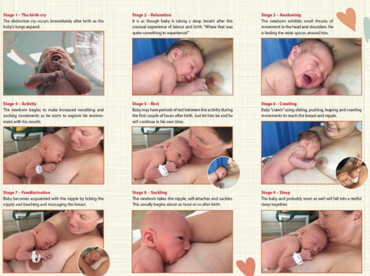
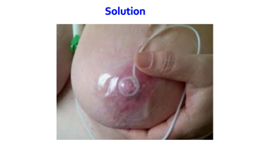

### infant anatomy and physiology for feeding

البابي بيبدا يتعلم البلع من وهو لسه ف بطن امه ب انه بيبلع ال aminion fluids او السائل المنيوني اللي حواليه

الكلام ده بيحصل فى الاسبوع ال <mark> 16-18 </mark> من الحمل

لاحظ ان كلمة suck دي بنستخمها مع الرضاعه من ال bottle بس انما لما يرضع من ال breast البابي هنا بي suckle لانه بيطلع اللبن من ثدي الام ب مجهود اكبر

البابي لما يوصل 32 اسبوع بيقدر انه ي suckle ال mother breast ويبلع اللبن لحد 10 مرات ورا بعض من غير ما يقف, يعني مش بيكون محتاج يقف كتبر زي ال preterm عشان يتنفس

قوة المص عند البابي بتكون ف اقوى صورها <mark> مباشرة بعد الولاده </mark> 

كل ما زاد تدفق اللبن من صدر الام قل معدل ال suckeling والمجهود اللي الطفل محتاج يعمله

مجرد ما البابي يتولد نيمه على بطنه على صدر الام هتلاقيه بدا ي lick او انه يحرك فمه عموما عشان يستكشف البيئه اللي حواليه عن طريق فمه 😂💚 هتبدا تلاقيه بدا ي crawl او يزحف على صدر الام ويحرك راسه وكتفه ورجليه بحيث يعدل جسمه و وشه يبقى مواجه لصدر الام , هتبدا تلاقيه اتعرف على ال nipple ب انه بدا ي lick وي touch و يعمل مساج لل mother breast واتحرك ناحية ال nipple و بدا يرضع لوحده خالص, ال montgomery gland اللي موجوده حوالين ال nipple او فال aerola تحديدا بتفرز ماده ريحتتها شبه ريحة ال سائل الامنيوني اللي كان متحاوط بالطفل ف بطن امه ف ده بيساعده يتعرف عال nipple اسرع لما يشمها

العمليه دي بتحصل تلقائيا وفطريا منه من غير اي تدخل مننا, بتاخد تقريبا حوالي ساعه على بال ما البابي يبدا يرضع, ولو الام كانت واخده اي مخدر العمليه دي ممكن تاخد ساعتين عشان البابي بيكون متاثر بالمخدر شويه

> [!CAUTION]
> مينفعش ترضع البابي وهو بيعيط عشان لسانه بتكون لامسه ال palate اللي هو سقف الفم ف مش هيعرف يعمل latch on the breast كويس

على عكس لما تعمله ال rooting reflex هتلاقي لسانه تحت ف اسفل فمه ف ممكن يعمل latch on كويس

ال rooting reflex ده لما تحركي ال nipple على خد البابي او بالاصح على ال corner of mouth اللي هي فمه من الجمب عند الزاويا هتبدا تلاقي البابي بدا يلف راسه ناحية صدر الام ويرضع لوحده

watch [this](https://youtube.com/shorts/fowM-Ru53U4?si=jvJWHDinoHCbvfqc)

---

### nutritive suckeling and non-nutritive suckeling

ال nutritive suckeling دي بتكون 1 suckel per second يعني البابي بيمص بمعدل مصه واحد فالثانيه ودي هي الرضعات اللي فعليا بتكون مغذيه وبيكون فيها لبن, انما في حاجه اسمها non-nutritve suckeling او الرضعات اللي مفهاش تغذيه حقيقيه للبابي يعني مبيكونش فيها لبن او لبن قليل جدا ودي بتكون ف صورة 2 suckel per second يعني البابي هتلاقيه بيمص بسرعه وبيريح شويه بيمص بسرعه وبيريح شويه ودي بيكون ليها بعض الفوايد برضو زي تحسبن الحركه المعديه و المعويه او ال peristalsis بتزود العصارات الهاضمه او digestive fluids بتقلل بكاء الطفل وطبعا بتحفز افراز اللبن وبترفع من قوة تحمل الام والبابي للألم

الرضاعه الطبيعيه بتقلل حدوت oxygen desaturation وبتمنع حدوت ال brady cardia عن ال bottle feeding

حركة ال tongu وقت الرضاعه الطبيعيه بتكون perstalitic عادي يعني ف شكل موجه من قدام ل ورا , انما مع ال bottle feeding بتكون شكل piston-like

----
### Suck cycle

البابي لما ييجي يرضع بيمر ب تلت مراحل , اول مرحله اللي هي ال suckeling او المص بعد كده بي swallow او بيبلع المرحله التالته انه ياخد نفسه حبه قبل ما ي suck تاني 

على الاسبوع ال 28 البابي هيكون قادر انه ينظم العمليه دي كويس اللي هي زي ما قلنا بي scukel ثم بيبلع ثم بيتنفس

الطبيعي طبعا ان ال عمليه دي مش بتأثر على التنفس اوي وبتكون بنسبة واحد الى واحد الى واحد بمعنى بيمص ف ثانيه بيبلع ف ثانيه وبيتنفس ف ثانيه 

اول دقيقتين فال suckeling سرعة المص بتكون عاليه عشان نحفز افراز اللبن او ال milk ejection reflex يحصل بعد كده بتبدء تبطأ تدريجيا

mild cyanosis is common even in well cordinated breating esp. in neonates, baby usually don't give a shit about his cyanosis and continue to suckle and the cyanosis recovers spontaneously, also saturation normally declined during the feeding

tongu occupy 100% of the infant's mouth in rest, so can't breath from mouth so children are mainly <mark>nose breather</mark> except when hypoxic become mouth and nose breather

low birth weigth and preterm may get fatigu easily during feeding so -> it's ok to give them some rest and then continue

<mark>paced bottle feeding</mark> solve disorganize feeding cycle problem, in which we remove the bottle nipple or removing the milk from the bottle nipple at frits sign of disoranized feedings to allow the infant to rest

give baby rest by lowering the bottle so there is no milk in the bottle nipple and then continue

supportive positioning (semi elevated side lying with infant's head above his hips) also helps

For breastfeeding, prone positioning on a reclined mother and pressure on the breast to occlude some ducts during rapid milk flow are effective pacing techniques.

for the first few feedings even in full term infant, suckeling is usually disorganized

Infant <mark>feeding problems with resultant poor weight gain</mark> may be the earliest indicator of various <mark>neurologic</mark> problems.

Developmental delays and neuromuscular disorders may not become apparent for many months, but subtle abnormalities in motor tone are usually present in infancy and may present as <mark>oral–motor dysfunction</mark> ,with resultant growth problems

choking, brief apnea, or poor pacing of the suckle/swallow/breathe cycle and very long feeding episodes may indicate neourological problems

### causes of inefficient suckeling
1. preterm (poor neurological function)
2. hypertonic (disrupt suck cycle rythm)
3. hypotonic (poor muscles strenght to suckel)
4. down syndrome
5. cardiac problems
6. nipple confusion 
7. neurological impairments
8. cleft lip or palate
9. perinatal asphyxia of fetus
10. poor weight gain

### solution

if paced feeding, supportive position and reclined positioning didn't work, we can also try the feeding-tube device and nipple shield

for the tube-feeding device you can put the bottle either above, at or below or at the level of baby's mouth according to his suckeling strenght

# watch [this](https://vimeo.com/207503100)

**nipple shield**

it's almost similar to feedng tube but with tube wrapped around the nipple in a sheild like material
### suckeling cycle notes

while suckeling, <mark>Depression and elevation of the posterior tongue</mark> happens while the anterior tongue maintains the seal on the breast.

During the feeding, the mother’s highly elastic nipple elongates (two to three times its resting length) into a teat.

the nipple base is the point of meet between nipple and aerola, at that base, <mark>the nipple is held between the upper gum and tongue that covers the lower gum.</mark>

A wave of tongue depression follows from front to back,
soft palate close the nose and epiglottis close the larynx

when suckeling the nipple or teat reach <mark>near but not at the juction of the hard and soft palate</mark>

<mark>hard palate is shaped by tongu movements.</mark>

----
### feeding during sleep
Forcing the infant to the breast might abolish the rooting reflex and disturb placement of the tongue.

### frequency of feeding
for the first 6 months, 8-12 times per day which equals to almost 4 hours perday

nigth feeds 1-5 time