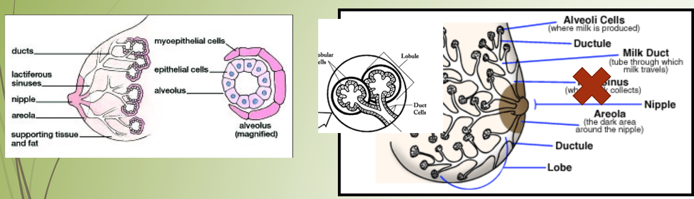
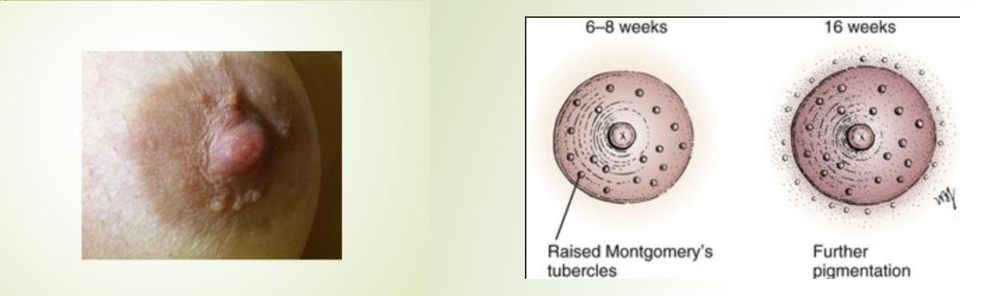
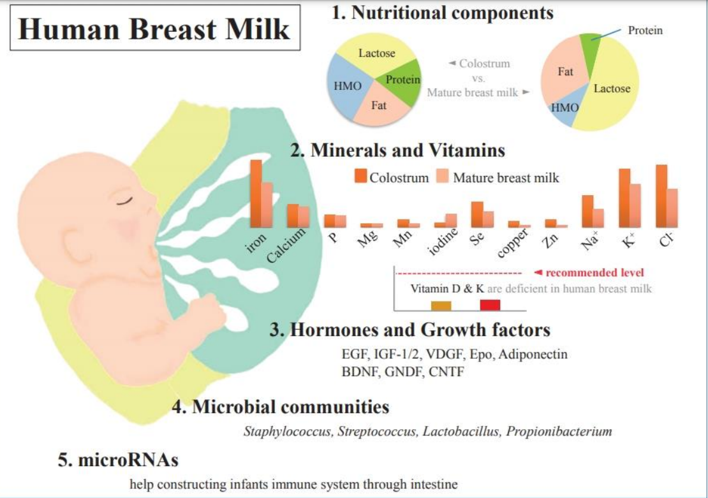
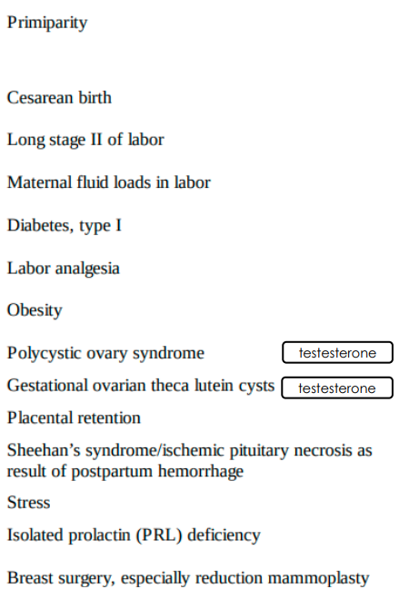
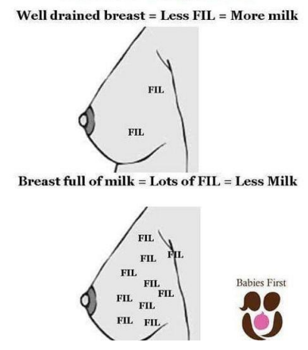
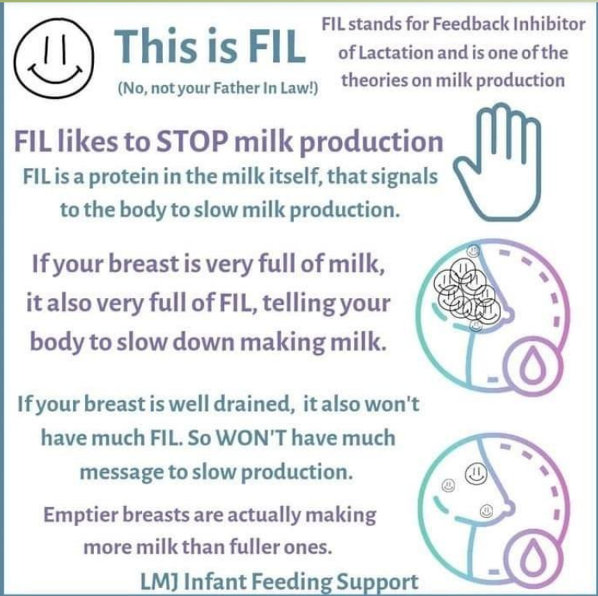
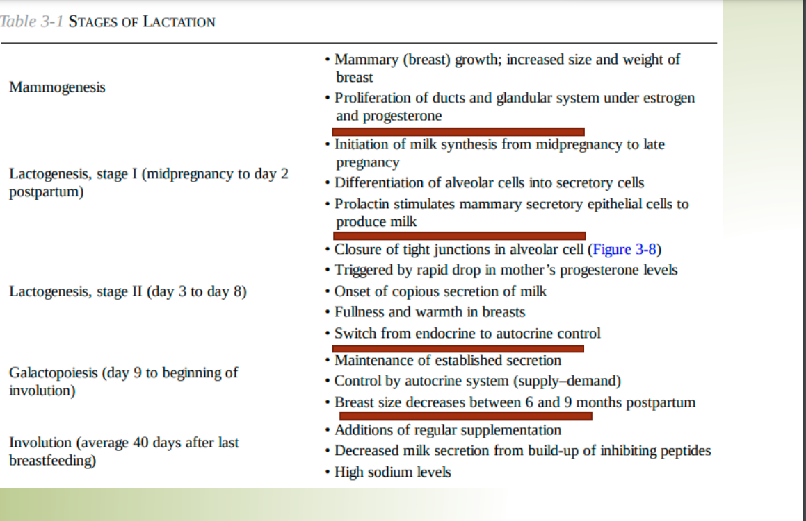

# Physiology of Lactation

> [!NOTE]
> Mammary ducts do not widen into sinuses behind the nipple as previously thought, but the ducts are distensible and expand as they fill with milk during the milk-ejection process.

### During pregnency
- **progesteron** responsible for alveolus profileration 
- **estrogen** stimulate ducts growth
- **Placental lactogen**: Promotes areolar growth
- **Montgomery `s glands** enlarge

### after delivery

prolactin stimulates nipple growth.
ACTH AND GH Combine with prolactin and progesterone to promote mammary growth. 

### Lactogenesis 1 (secretory differentiation)

from 16th week of pregnancy up to labor

Differentiation of alveolar lactocytes into secretory cells.

Colostrum is rich in sodium ,chloride and proteins

Copious milk is rich in lactose and fat.

### Lactogenesis 2(secretory activation) :
- triggered by Drops of progesteron at delivery triggering copious milk production.
- starts from copious milk secretion 2-8 days.
- when progesterone level drops.

### factors inhibiting lactogenesis

### + maternal infant seperation

## Galactopoiesis
- Galactopoiesis (day 9 to beginning of involution)
- Maintenance of established secretion 
- Control by autocrine system (supply–demand)
- Breast size decreases between 6 and 9 months postpartum

### supply demand response

feedback inhibitor of lactatoin (FIL) is a proteing in breastmilk that signals the brain to slow down production

**milk synthesis is controlled by 2 mechanisms**
- feedback inhibitor of lactation
- prolactin receptor theory

### Involution and apoptosis
#### Involution
is characterized by a progressive reduction of all glandular tissue with a proportional increase in the amount of fat and connective tissue
#### Apoptosis
a form of programmed cell death

weaning should be gradual so involution occur healthier and breast shape remain good

------

In the post-partum period, some women may experience difficulty with lactation if they have inadequate milk production, poor milk extraction, and insufficient caloric intake to meet demands

Current recommendations for lactating women is to have a minimum excess of 500 calories per day to meet the caloric demands for milk production. Women are also encouraged to empty the breast as often as possible, typically every 2 to 3 hours to maintain milk supply

Other issues of concern regarding lactation include the infants inability to latch, nipple pain, mastitis, or plugged ducts.

Once puberty is complete, no further changes occur to the female breast until pregnancy. 

During pregnancy, stage-II mammogenesis (alveolar development and maturation of the epithelium) occurs largely in response to higher levels of progesterone. 

The increased volume of breast tissue during pregnancy is a result of the proliferation of secretory tissue

Finally, the involution of mammary glands occurs with the cessation of lactation and requires a combination of lactogenic hormone deprivation and local autocrine signals that signal apoptotic cell death and tissue remodeling

