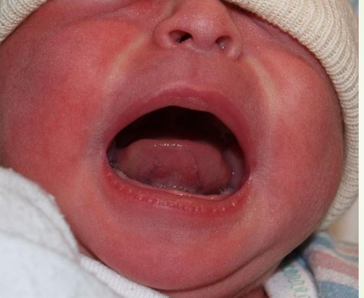

# tie tongue

### normal tongue

The Wharton’s duct, also known as the submandibular duct, is the main excretory duct of the submandibular salivary gland. It is located on the floor of the mouth beneath the tongue.

### Ankyloglossia
The presence of a sublingual frenulum ( a small fold of tissue that secures the motion of a mobile organ in the body.) that changes the appearance or function of the infant’s tongue because of its decreased length, lack of elasticity, or attachment too distal beneath the tongue or too close to or onto the gingival ridge

‘snap back’ – something
breastfeeding supporters often call
‘clicking’ at the breast. The tongue
tries to extend forward but a tight
lingual frenulum ‘snaps’ the tongue
back – every few sucks or even every
suck and makes a characteristic
‘clicking’ noise

treated by Frenotomy (a.k.a. frenulotomy or frenulectomy) is the procedure in which the lingual frenulum is cut.

scissors is the
gold standard for frenotomy

#### issues of tongue or lip ties

### pathological aeorophagia

when due to poor latching baby swallows a lot of air

> [!IMPORTANT]
> why ? The baby can not be able to swallow correctly because he can not raise the tongue.

speech impairement is enhanced by frenulectomy

can cause sleep apnea

### low posture tongue

leads to high arched palate and mouth breathing
### two tone tongue

often mistaken for thrush

### tongue dent

### signs
