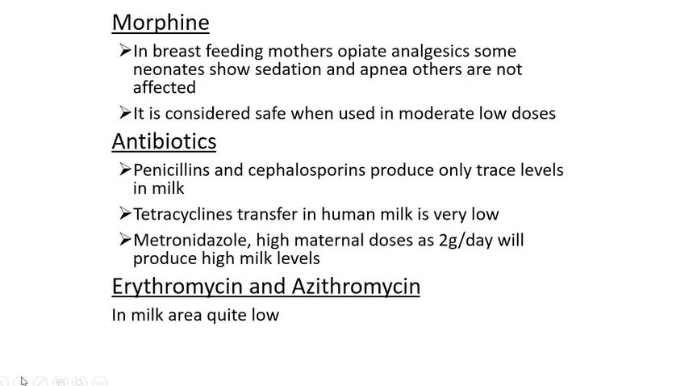
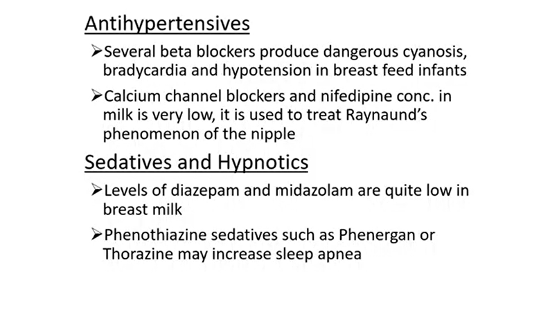
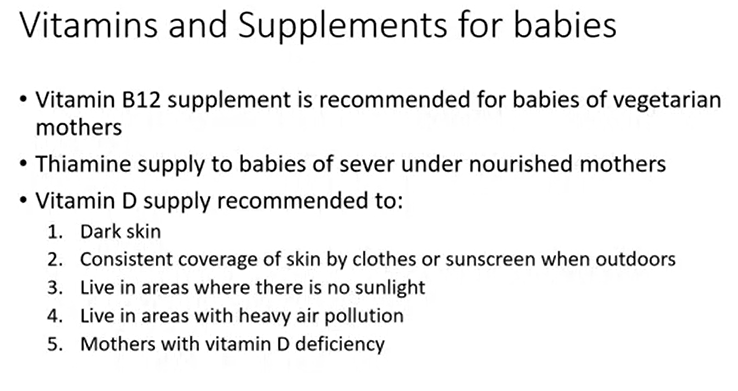

# Drugs Compatible

> [!NOTE]
> Topical treatments is not contraindicated with lactation as it delevers only consistent small amount to mohters blood

### NSAIDS
1. Ibuprofen and ketorolac are ideal with low RID < 0.6 %
2. aspirin -> high incedince of Reye's syndrome in neonates so is not recommended for breast feeding mothers 

> [!TIP]
> so if aspirin is intended to use as NSAID replace with <mark>ibuprofen or ketoroloac</mark>, if for antiCoagulation effect replace with <mark>heparin or warfarin</mark>

## Opioids
1. **Methadone**: widely used to treat addicted pregnant women but <mark>not safe</mark> as high rate of neonatal abstinence syndrome occur for neonates of those mothers
2. **morphine** is safe in low and moderate dose, can cause neonate sedation and apnea in high dose

## Antibiotics
1. penicillins, cephalosporins, teracyclines, erythromycin, azithromycin are safe
2. metronidazole not safe -> health teach the mother to express breast milk before starting metronidazole thearpy and store the milk to feed the baby during the treatment period

## Antihypertensives
1. BetaBlockers are not safe, can cause cyanosis, bradycardia and hypotension to the infant
- calcuim channel blockers and nifedipine are safe and can be used to treat <mark>Raynaud's phenomenon of the nipple</mark>

## sedatives and hypnotics
1. diazepam and midazolam are safe
2. phenothiazine e:g phenergan or thorazine can cause sleep apnea so not safe

## AntiDepressants
- SSRIs are safe with lactation

## Antimanic
- lithium is contraindicated
- can be replaced with Valporic acid

## Corticosteroids
- are safe even with high doses as these drugs molecular weight is high so don't pass to human milk

### Thyroid and AntiThyroid
both are safe as long as in the noraml thyroxine level

## Radioisotopes
- absolute contraindicated with lactation espicially <makr>Iodine 131</mark> which destroys infant's thyroid and increase risk of thyroid carcinoma
- mother must pump and discard their milk for <mark>12-24</mark> hours and then continue breast feeding

## Vaccines
- yellow fever vaccine is contraindicated with lactation cause it may lead to encephelitis, If must to be taken avoid BF for <mark>2 weeks</mark>

**Mammogram** with breast feeding is painful cause the breast is congested with milk

**Sulfate** products is contraindicated with breast feeding
