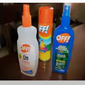
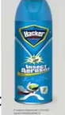
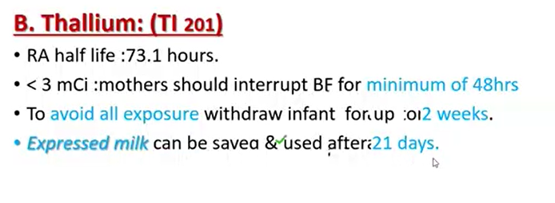
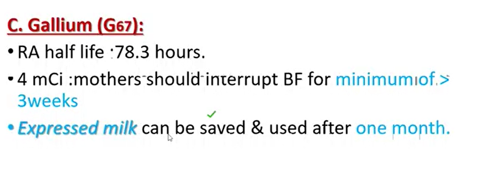
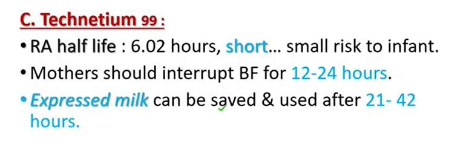

# Lactation Toxicology

### pesticides
1. **organochlorines (DDT)**
are lipophilic, mothers heavily contaminated should not BF
- **DEET(N-diethyl-metal-toluamide)**
safe proven by EPA and CDC

- **permethrin**

most widely used, very low mammalian toxicity but transfer to breast milk is still <mark>under trial</mark>

## Beauty Aids & Cosmetics
- low toxicity
- Hair products, colognes and perfumes, nail polish remover e:i acetone and ethanol are all **safe to use**
- Hair Straighteners e:g proteins and creatine and nail glue removal have the greatest potential harm

## Radioactive compounds
**iodine** is contraindicated with lactation can supress infant's thyroid function and increase risk of thyroid carcinoma

> [!TIP]
> avoid showering the baby with <makr> betadine shower</makr> as it has high amount of iodine

if a mother take radioactive iodine and then expressed milk, the milk should be kept in freezer for at least <mark>8-10</mark> times the half-live period of the iodine and then can be fed to the infant, these bottle of milks should be kept in a seperate freezer

mother **shouldn't sleep** with their infant for <makr>3-23 nights</mark> and should stay a minimum of <mark>6 feets</mark> away from the infant, even changing diaper is hazardous !

### Types of radioactive iodine
1. **131**: half life is <mark>8.1 days</makr>
    - if taken in tracer dose(0.1microCi): mother can resume BF by <mark>8th day</mark>
    - larger dose resume BF by <mark>46th day</mark>

2. **125**: half life is <mark>60.2 days</mark>
discontinue BF

3. **123**: half life is <mark>13.2 hours</mark>
- dosse of < 2mCi mohter would express her milk for <mark>12-24 hours</mark>
- saved and used after 7-5 times half-live (about 3-4 days)

> [!TIP]
> the <mark>123</mark> is preferred if applicable

### Thalium

### galium

### Technetium

