Most CNS-active durgs like <mark>Psychotropic e:g amphetamines</mark> are low in molecular weight and are very lipid soluble

<mark>neuroleptics e:g diazepam (valium), chlorpromazine(thorazine)</mark> are lipid soluble

<mark>heparin, insulin, interferon</mark> don't pass to milk due to high molecular weight

<mark>lithium</mark> pass to milk due to low molecular weight and low protein binding capacity

high protein binding medictions like <mark>NSAIDs, warfarin</mark> don't pass

<mark>proteins, peptides and amionglycosides</mark> are destroyed in GIT, <mark>Vancomycin and gaviscon</mark> are not absorbed in small intestine, <mark>domperidone</mark> is significanly metabolized in gut wall, so all of these with low bioavailability are safe

> [!caution]
> <mark>doxorubicin and methotrexate</mark> despite their low oral bioavailability are still contraindicated with BF

> [!NOTE]
> it takes <mark>5 times</mark> the half-live of a drug to be eliminated completely from the body\
> **short half-life**: <mark>penicillin, isoniazid</mark>\
> **long half-life**: <mark>radioactive iodine</mark>

### milk plasma ration

<mark>rantidine</mark> has high M/P ration, but the absolute dose transferred to infant is still subclinical due to low levels in mother plasma so can be given safely with lactation

### Active drugs
valacylovir(valtrex), codeine, Hydroxyzine (vistaril), fluoxetine(prozac) metabolites into the active drug form, so this form may have much longer half-life than prodrug or parent drug, more e:g include
- norfluoxetine from fluoxetine
- normeperidine from meperidine
- cetirizine(zytrec from hydroxyzine)

in below photo the yellow medication can be used with caution and the red ones are contraindicated with BF other mediacations not listed is considered safe.

you can check if a medication is safe with lactation from lactmed website

### Analgesics 
1. **safe**
    - NSAIDs e:g ibubrofen, voltarine, ketorolac, etc..
1. **use with causion**
    - fentanyl (but avoid patches route)
    - methadone -> monitor infants withdrawal symptoms
    - morphine -> monitor sedation, apnea and respiratory distress in infants
2. **contraindicated**
    - aspirin -> Rey's syndrome
    - codeine
    - oxycodone
    - tramadol
    - meperidine

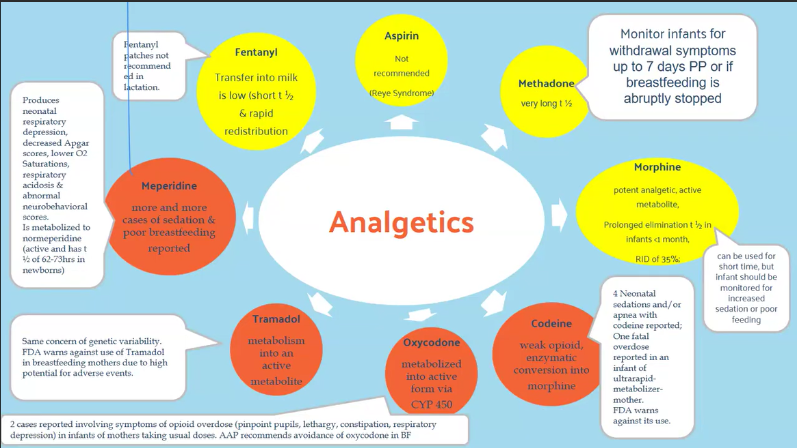

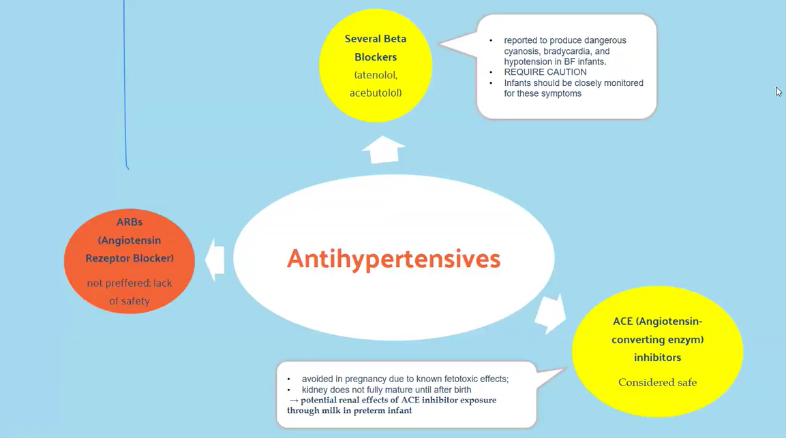

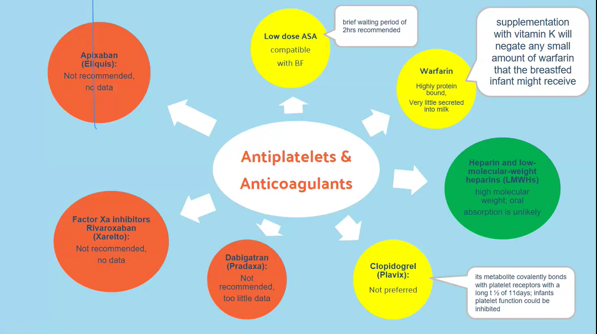

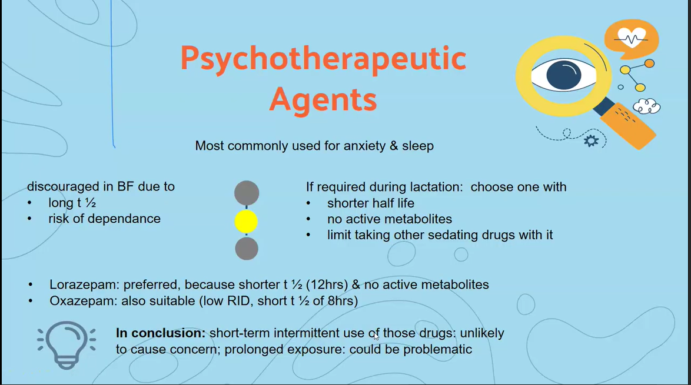

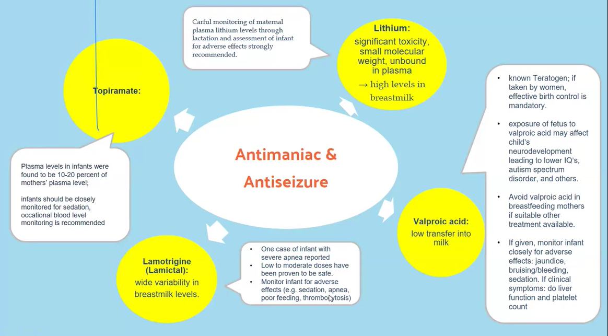

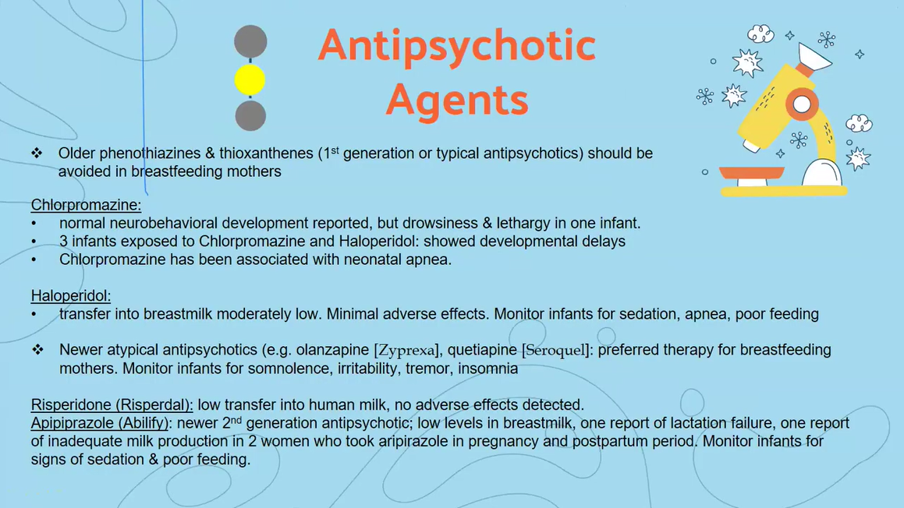

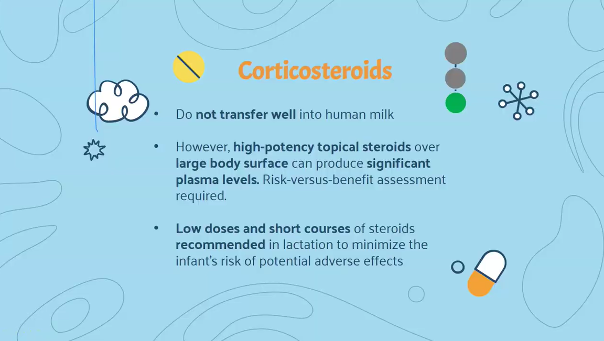

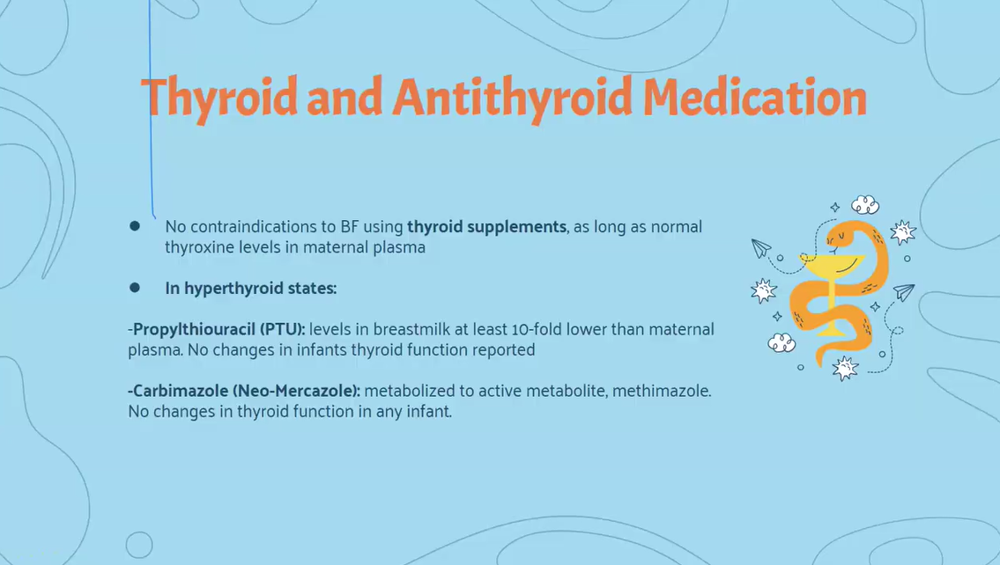

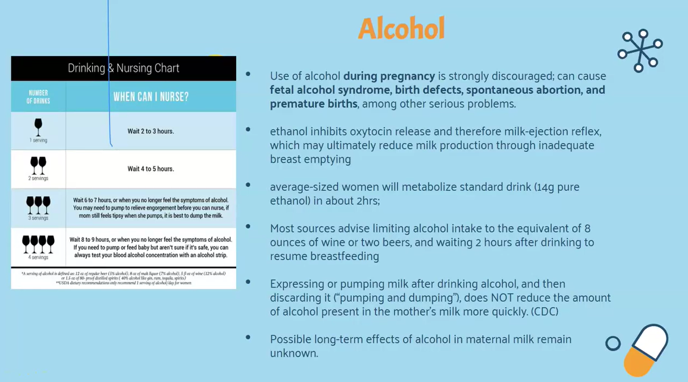

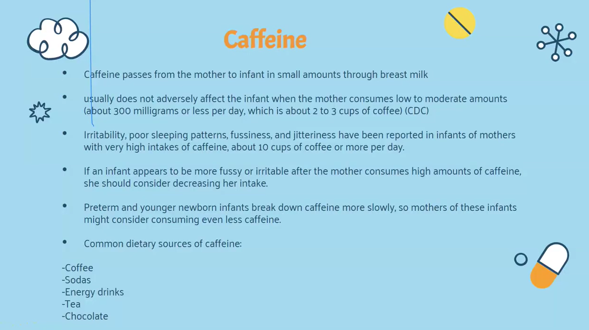

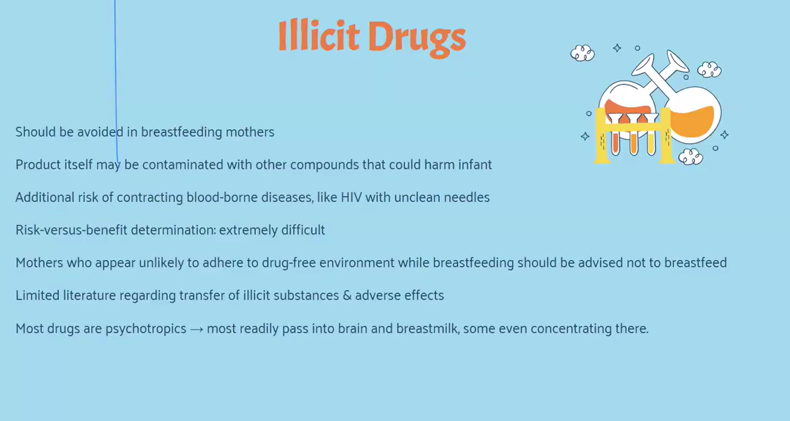

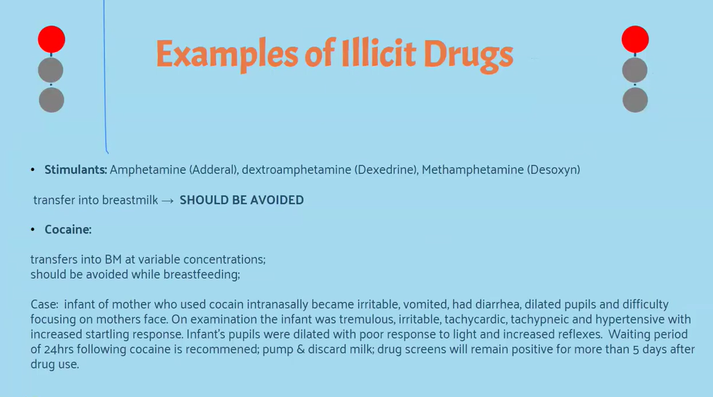

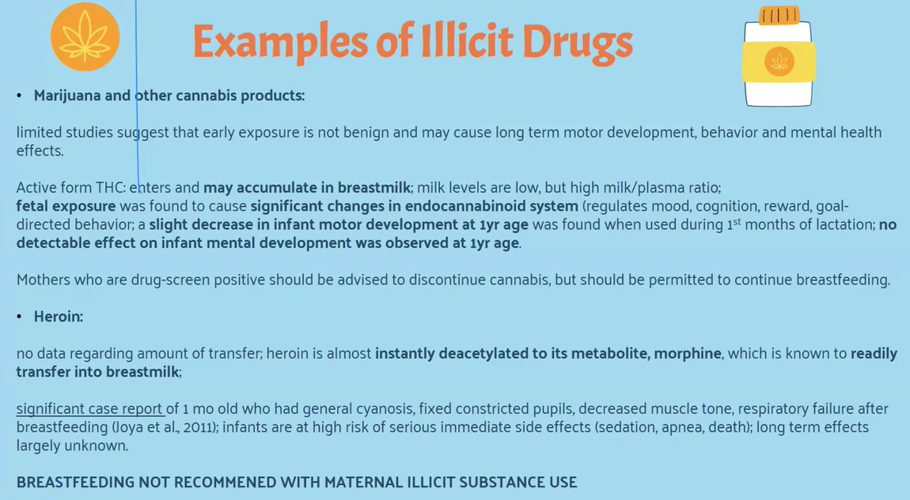

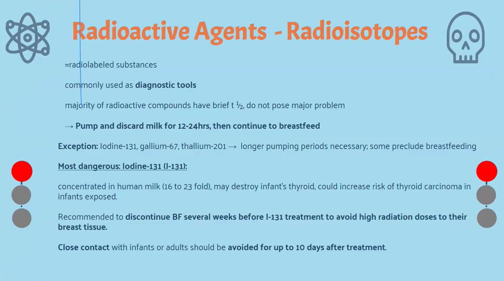

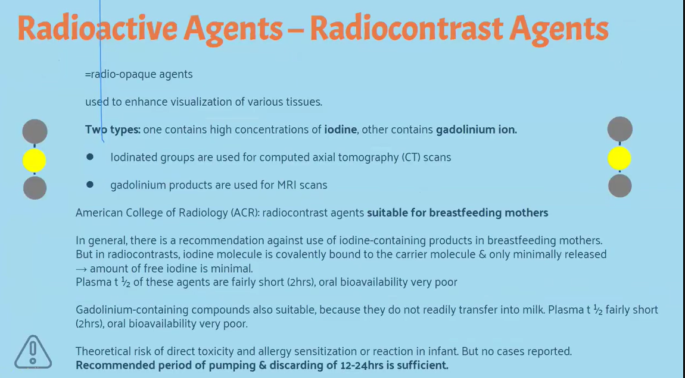

