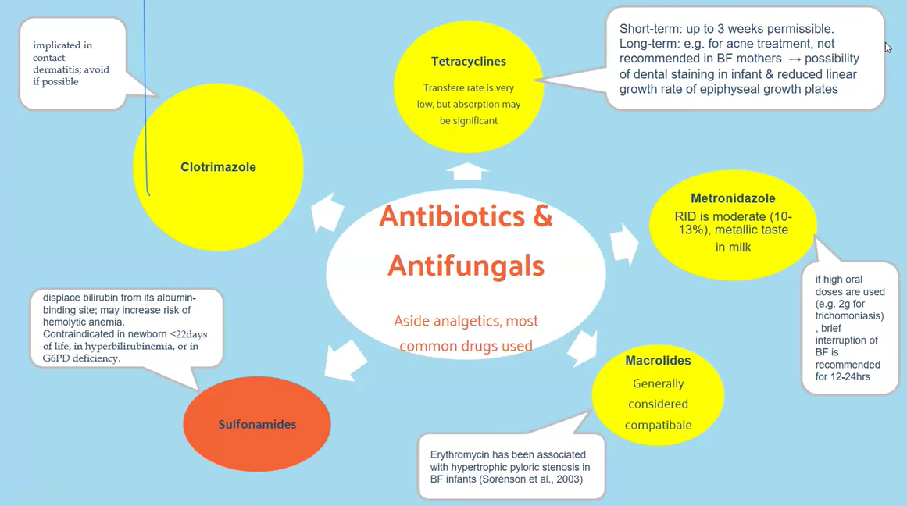
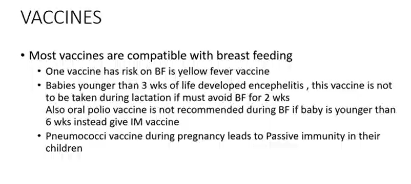
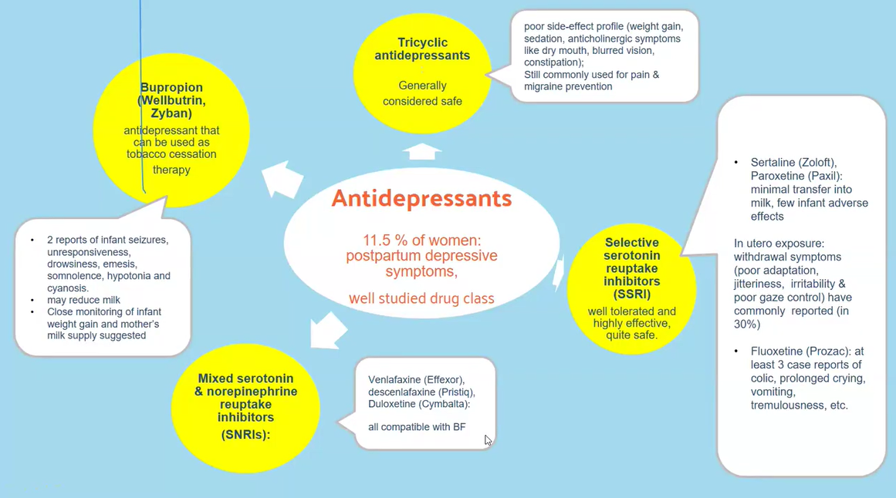
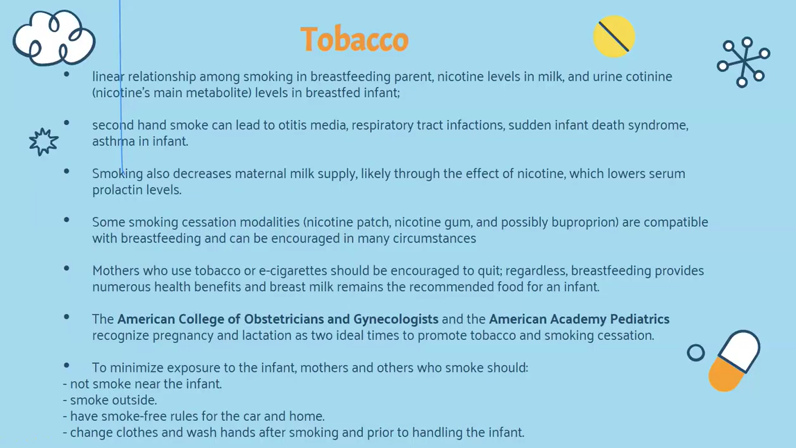

Most CNS-active durgs like <mark>Psychotropic e:g amphetamines</mark> are low in molecular weight and are very lipid soluble

<makr>neuroleptics e:g diazepam (valium), chlorpromazine(thorazine)</mark> are lipid soluble

heparin, insulin, interferon don't pass to milk due to high molecular weight

lithium pass to milk due to low molecular weight and low protein binding capacity

high protein binding medictions like NSAIDs, warfarin

proteins, peptides and amionglycosides are destroyed in GIT, Vancomycin and gaviscon are not absorbed in small intestine, domperidone is significanly metabolized in gut wall, so all of these with low are bioavailability are safe

doxorubicin and methotrexate despite their low oral bioavailability are still contraindicated with BF

it takes 5 times the half-live of adrug to be eliminated completely

short half-life: penicillin, isoniazid

long half-life: radioactive iodine

milk plasma ration

rantidine has high M/P ration, but the absolute dose transferred to infant is still subclinical due to low levels in plasma 

valacylovir(valtrex), codeine, Hydroxyzine (vistaril), fluoxetine(prozac) metabolites into the active drug form, so this form may have much longer half-life than prodrug or parent drug, more e:g include
- norfluoxetine from fluoxetine
- normeperidine from meperidine
- cetirizine(zytrec from hydroxyzine)

in below photo the yellow medication can be used with caution and the red ones are contraindicated with BF

