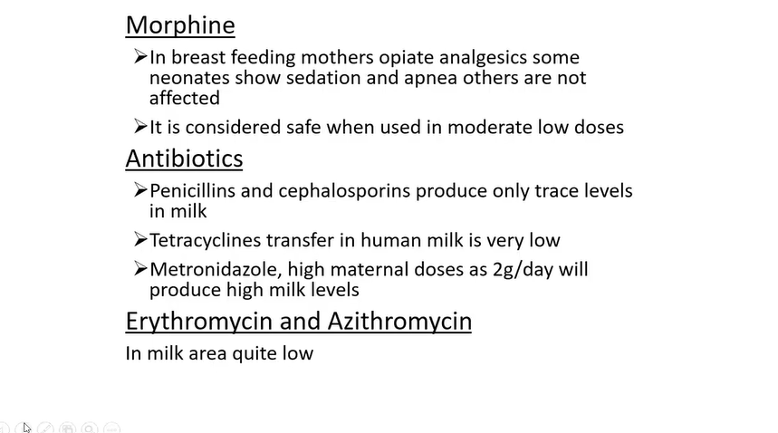
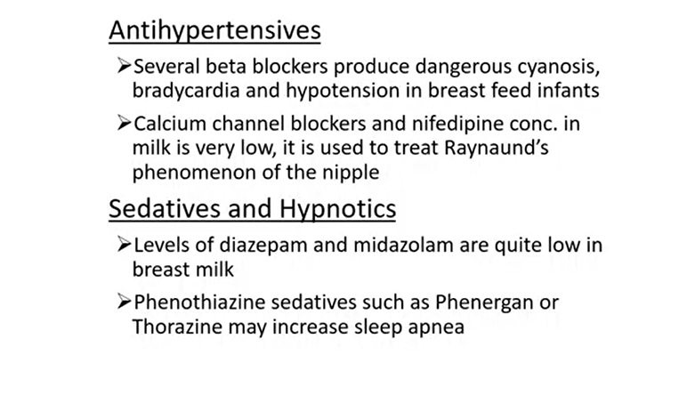
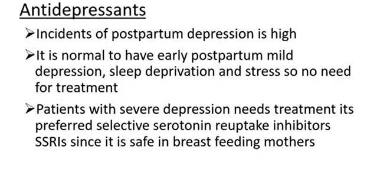
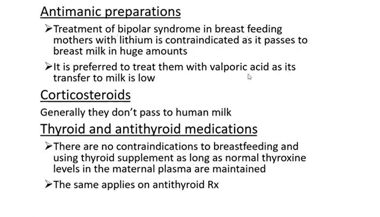
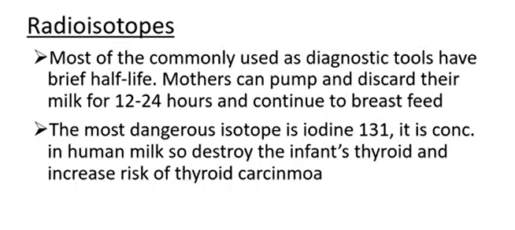
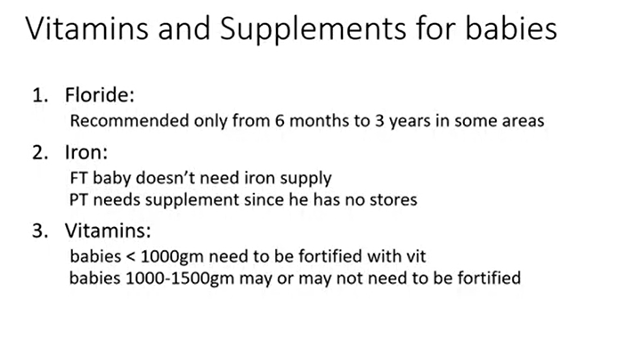
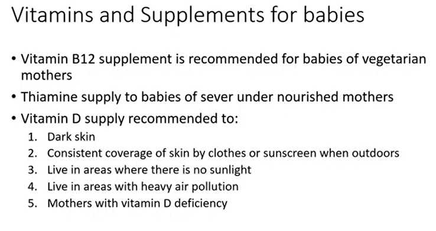
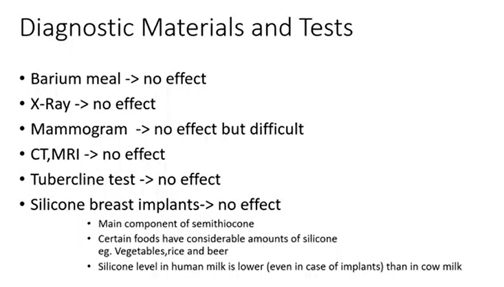
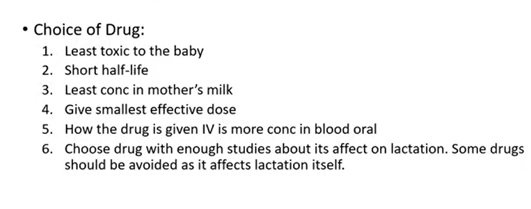

# Drugs Compatible

> [!NOTE]
> Topical treatments is not contraindicated with lactation as it delevers only consistent small amount to mohters blood

### NSAIDS
1. Ibuprofen and ketorolac are ideal with low RID < 0.6 %
2. aspirin -> Reye's syndrome is not recommended for breast feeding mothers 

> [!TIP]
> so if aspirin is intended to use as NSAID replace with <mark>ibuprofen or ketoroloac</mark>, if for antiCoagulation effect replace with <mark>heparin or warfarin</mark>

## Opioids
1. **Methadone**: widely used to treat addicted pregnant women but <mark>not safe</mark> as high rate of neonatal abstinence syndrome occur for neonates of those mothers

**Sulfate** products is contraindicated with breast feeding
